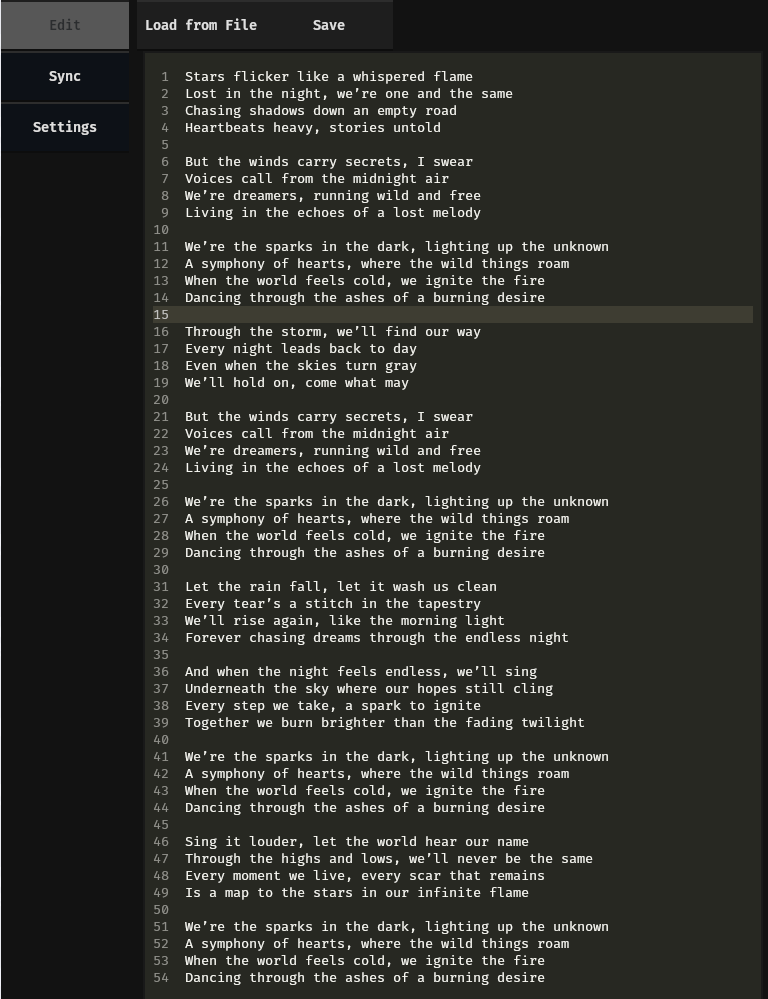

# pyAMLL

pyAMLL is a tool that can be used to manually sync up lyrics of a song to its timestamps (down to the syllable). 

The main source of inspiration comes from Apple Music with their syllable-synced lyrics. The end goal is to make a tool that generates file that are compliant with another tool by @Steve-Xmh - [amll-ttml-tool](https://github.com/Steve-xmh/amll-ttml-tool).

This works with a TUI with the help of [Textual](https://github.com/Textualize/textual) which is a python framework used to create interfaces within the TUI.


## Installation

```sh
git clone https://github.com/sortedcord/pyAMLL.git
```

pyAMLL makes use of [poetry](https://python-poetry.org/docs/#installing-with-the-official-installer) as package manager. After installing poetry on your system, just install the tool:

```sh
cd pyAMLL
poetry install
```

And then run the `tui.py` file

```sh
poetry run python pyAMLL/tui.py
```

## Usage

### Editing Lyrics

pyAMLL consists of an `Edit` tab where you can add your lyrics either by using the in-built editor or adding them from a text file.



A single word can be split into multiple parts (syllables) and timed accordingly. This can be done by using `/`

For example, `heart/beats` splits into `heart` and `beats` and timed as per the song.


### Loading a music file

Before using the controls, you need to load in music by clicking on the folder icon in the extreme bottom right corner and then entering the location of the music file. You can then click on play to play the music file which also serves the purpose to initialize a player instance.

Other available controls include seeking forward or backward (by 5 seconds), increasing/decreasing speed, seeking to a portion of the track, volume controls.

### Syncing Lyrics

When Lyrics have been edited, they can be synced to the song on the sync screen. This has a word carousel on top which shows which word (or part of word) is currently being synced along with its start and end timestamps.

You can move the active word by pressing the arrow buttons just below the carousel. The `F` Button sets the `start_time` of the word as the current timestamp and `H` sets the `end_time` of the word as the current timestamp. The `G` Button sets the `end_time` of the word as the current timestamp then moves to the next word and sets its `start_time` as current timestamp.